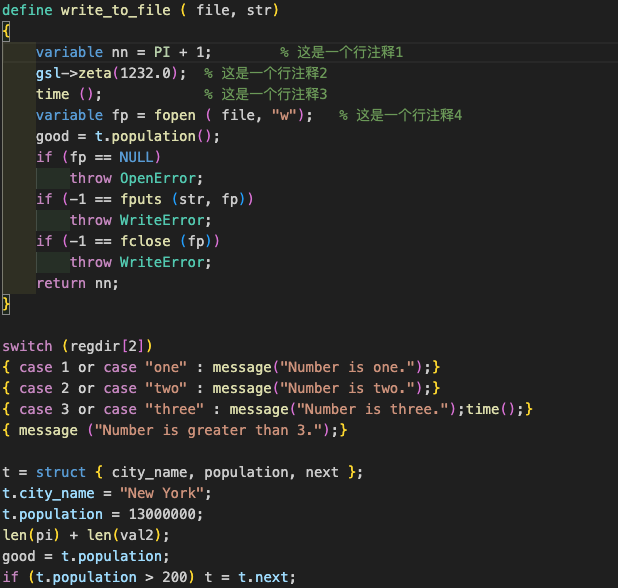

# slang-syntax README
Vscode extension for the syntax hightlight for [S-Lang](https://www.jedsoft.org/slang/)(.sl) sripts.

---

## Features

### Syntax hightlight

## Requirements
vscode (>1.30).

## Known Issues
Currently do not detect normal variable.

### Select MATLAB as a language
* On the bottom-right corner, click on the *select language mode* button, if you have created a new file it should display *Plain Text*
* Select *S-Lang* in the list of languages.

Alternatively, saving the file with a `.m` extension, will allow VS Code to understand that it is a MATLAB file, and automatically select the language correctly.

## Release Notes

### 0.1.0

Initial release.

## For more information
* [S-Lang](https://www.jedsoft.org/slang/) Homepage.
* S-Lang Syntax [Reference and Guide](https://www.jedsoft.org/slang/docs.html)

**Enjoy!**
